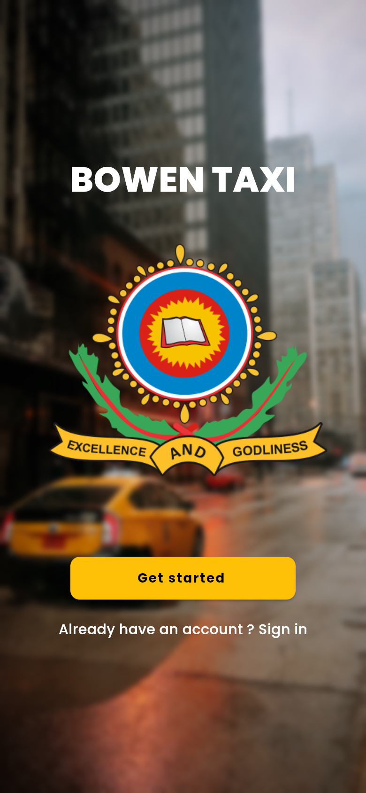
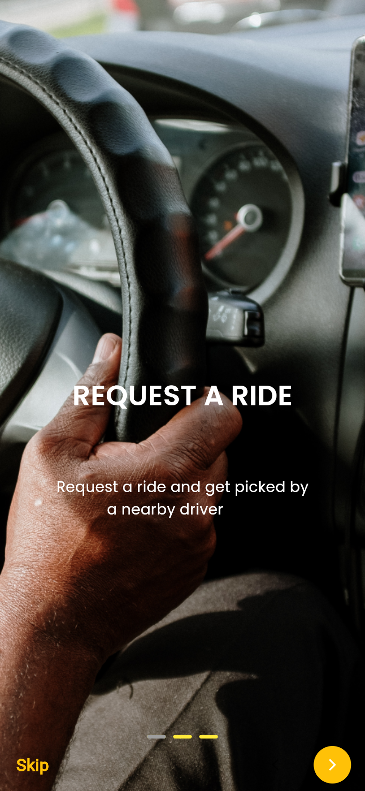
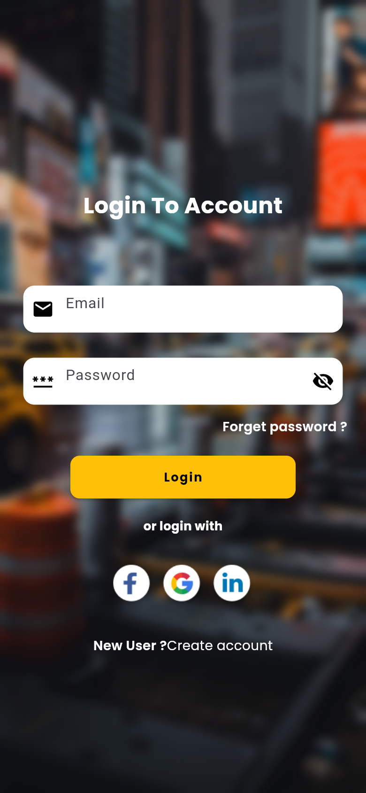
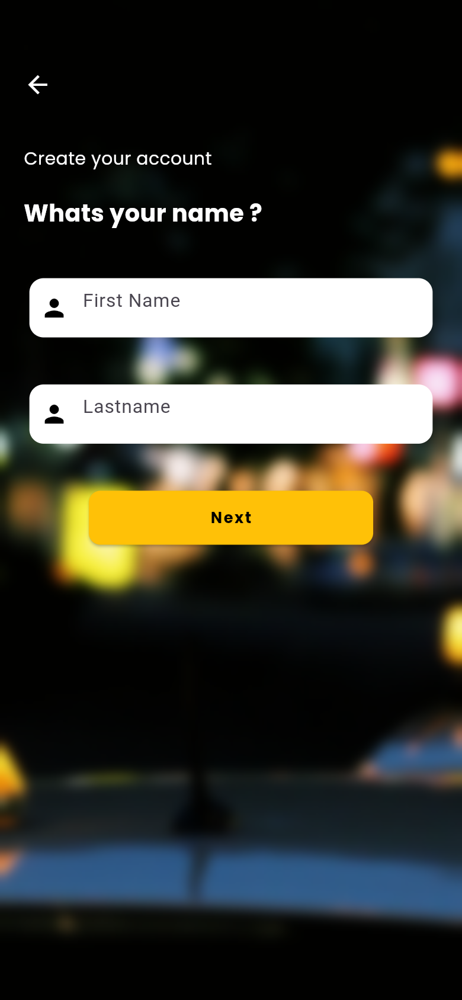
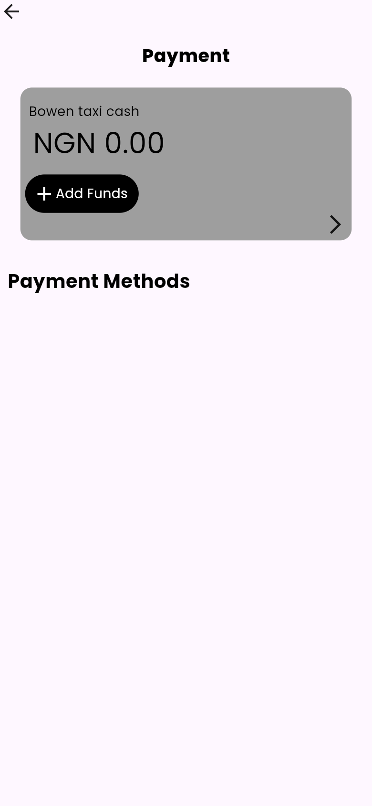

# Bowen Cab 🚕

**A campus ride-hailing app for Bowen University, built with Flutter and Firebase.**

Bowen Cab (branded in-app as *Bowen Taxi*) lets students and staff create an account, sign in and request a ride around campus from a live map, with a wallet for ride payments.


## Screenshots

<table>
  <tr>
    <td align="center"><br/><sub>Get started</sub></td>
    <td align="center"><br/><sub>Onboarding</sub></td>
    <td align="center"><br/><sub>Sign in</sub></td>
  </tr>
  <tr>
    <td align="center"><br/><sub>Step-by-step sign up</sub></td>
    <td align="center"><br/><sub>Campus welcome</sub></td>
    <td align="center"><br/><sub>Wallet</sub></td>
  </tr>
</table>

## Features

- **Firebase email/password authentication** for sign-in and account creation.
- **Four-step sign-up flow** (name → email → phone → password) with shared form state held in a GetX controller. New rider profiles are saved to **Firebase Realtime Database** under `users/{uid}`.
- **Live map home screen** built on Google Maps with the rider's current location (`geolocator`) and a camera that animates to it.
- **Side drawer** with profile, payment, promotions, my rides, travel, support, about and a "Become a driver" entry.
- **Route search** screen with pickup and destination fields.
- **Wallet screen** ("Bowen taxi cash" balance, add funds, payment methods).
- **Onboarding carousel** with page indicator, a campus-themed welcome screen and a forgot-password screen.
- Toast feedback for auth errors (`fluttertoast`).

> **Status:** work in progress. Auth and user storage are wired to Firebase. Ride matching, the wallet, promotions and password reset are UI only so far.

## Tech stack

| Area | Tools |
| --- | --- |
| UI | Flutter Material, `google_fonts`, `flutter_screenutil`, `smooth_page_indicator`, `iconly` |
| State & navigation | `get` (GetX controllers, `GetMaterialApp`, named routes) |
| Backend | `firebase_core`, `firebase_auth`, `firebase_database` |
| Maps & location | `google_maps_flutter`, `geolocator` |

## Project structure

```
lib/
├── main.dart              # Firebase init, GetMaterialApp and named routes
├── controllers.dart       # GetX text-field controllers shared across sign-up steps
├── AllScreens/
│   ├── getstarted.dart    # Landing screen
│   ├── Sigin.dart         # Sign in (Firebase Auth)
│   ├── signupscreen.dart  # 4-step sign up + profile write to Realtime DB
│   ├── mainscreen.dart    # Google Map home + drawer
│   ├── search.dart        # Pickup / destination
│   ├── paymentab.dart     # Wallet
│   └── forgetpassword.dart, freestyle.dart, welcomeScreen.dart
├── onbboarding/           # 3-page onboarding carousel
└── widgets/
images/                    # Campus and car artwork
```

## Getting started

```bash
git clone https://github.com/Mickool17/bowen-cab.git
cd bowen-cab
flutter pub get
flutter run
```

Requires Flutter 3.x (Dart 3).

- **Firebase:** Android is configured via `android/app/google-services.json`. For your own project, run `flutterfire configure` and point `Firebase.initializeApp` at the generated options.
- **Google Maps:** add your Maps API key to `android/app/src/main/AndroidManifest.xml` (`com.google.android.geo.API_KEY`) and to `ios/Runner/AppDelegate.swift` before running the map screen.

## Author

Built by [@Mickool17](https://github.com/Mickool17)
